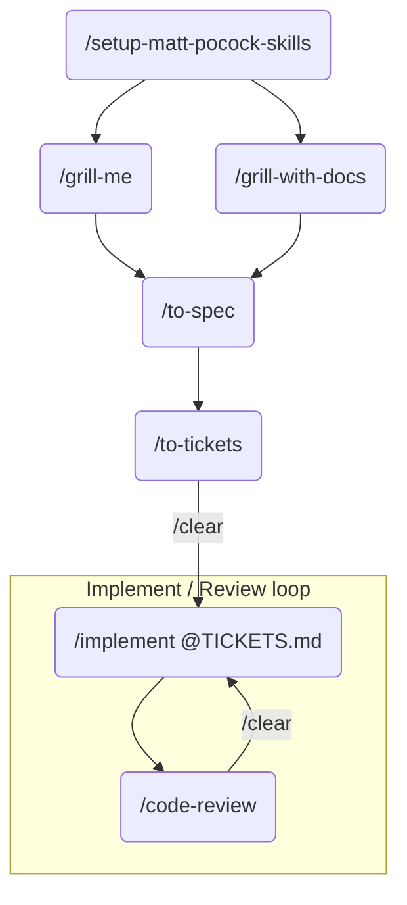

## Tools

### MCP

![[AI#Model Context Protocol (MCP)]]

### `AGENTS.md`

- **README for agents**
- A conventions file **for a specific project**.
- Tells the AI:
    - How *this* particular project is structured
    - What patterns and tools *this* project uses
    - What rules to follow when touching *this* codebase
- Project-local. 
    - It doesn't teach the AI *how* to do something well — it tells it *what to do* within a given context.

### Agent Skills (`SKILL.md`)

- Tells an agent *how to behave or execute a category of task correctly* — independent of any specific project.
- Used to encode process, judgement, workflow and conventions:
    - Which libraries actually work in this environment
    - Patterns that produce correct output for this task type
    - Constraints discovered through trial and error
- Reusable across projects. 
- Closer to a runbook or a recipe.

> [!note] **Skills vs ...**
> - **MCP**
>     - They both multiply whatever context an agent has access to. 
>     - Skills tell agents *how to think*, while MCP provides *what to think with*.
>         - If an MCP server provides access to docs or searchable reference material, a skill would describe how to navigate and apply that information.
>     - **Why not just use a skill for docs?**
>         - Because a skill is static. It cannot stay current with:
>             - new framework versions,
>             - changed APIs,
>             - evolving examples,
>             - project-specific overrides.
> - **AGENTS.md**
>     - Without a skill, AI might generate a valid-looking but wrong pattern. 
>     - Without `AGENTS.md`, it might generate something technically correct but inconsistent with the project.
>         - Serves more as contributing guidelines.
> 
> |            | `AGENTS.md`                | `SKILL.md`                 |
> | ---------- | -------------------------- | -------------------------- |
> | Scope      | One project                | Any project                |
> | Contains   | Project conventions        | How-to knowledge           |
> | Written by | You, per project           | You or a platform, once    |
> | Answers    | "What are the rules here?" | "How do I do X correctly?" |

## Best Practices

> [!success] Plan -> Execute

- **Use AI agents:** 
    - to compress thinking time.
- **Don't use AI agents:**
    - for certainty.
    - to infer missing context.
    - as a source of truth for APIs.
- **Make sure to**:
    - delegate but verify.
    - review outcome critically.
- Be aware of the **smart zone and dumb zone** in an agent's context window.

### Example: `@mattpocock/skills` Workflow

> [!example]- Steps
> 1. `/setup-matt-pocock-skills`
> 2. `/grill-me` / `/grill-with-docs`
> 3. `/to-spec`
> 4. `/to-tickets`
> 5. `/clear`
> 6. `/implement @TICKETS.md`
> 7. `/code-review`
> 8. `/clear` and repeat `/implement` 
